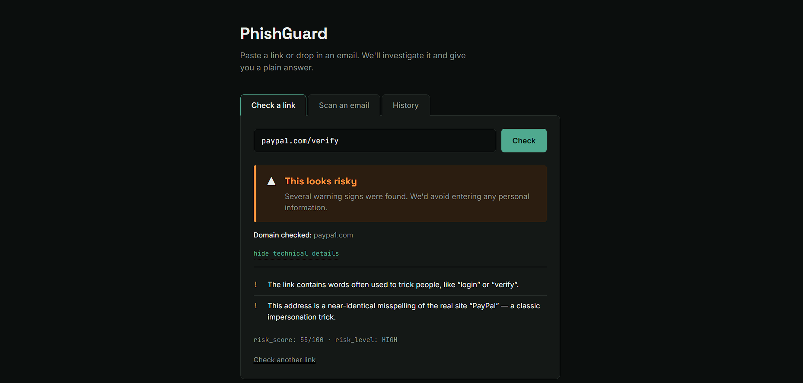

# PhishGuard

A phishing investigation tool that analyzes suspicious URLs and `.eml` email files, then explains *why* something looks risky — not just a yes/no answer.

Built as a personal cybersecurity project by a T.Y.B.Sc. Cyber Security & Digital Forensics student, to practice applying phishing-detection concepts (SPF/DKIM/DMARC, typosquatting, header analysis) in a working tool rather than just theory.

## What it does

**Check a link** — paste any URL and PhishGuard checks it for:
- Raw IP addresses used instead of a domain name
- Suspicious keywords commonly used in phishing (`login`, `verify`, `secure`, etc.)
- Punycode encoding (used to disguise lookalike domains)
- **Brand impersonation**, detected two different ways against a watchlist of ~25 commonly targeted brands (PayPal, major banks, shipping carriers, tech companies, crypto exchanges):
  - *Typosquatting* — a near-identical misspelling of a real domain (`paypa1.com`), measured with Levenshtein edit distance against the correct registered domain (not the raw hostname, so subdomains like `www.` or `accounts.` don't throw off the comparison)
  - *Brand stuffing* — the brand's name embedded in a domain that isn't actually theirs (`paypal-security-verify.com`), which edit distance alone can't catch since the strings aren't character-level "close"

**Scan an email** — upload a `.eml` file and PhishGuard checks:
- Sender vs. Reply-To domain mismatch
- SPF / DKIM / DMARC authentication results (parsed from the `Authentication-Results` header)
- Every URL found in the email body (plain text and HTML), each run through the same URL analysis above

Each check contributes to a weighted risk score (0–100), which maps to a plain-English verdict (Low / Medium / High / Critical) — full technical detail is available but hidden behind a "show technical details" toggle, so the tool is usable by someone with zero security background.

**History** — every investigation is logged locally to a SQLite database, so past results are browsable later. Individual entries or the entire history can be cleared from the UI.

## Screenshot



## Tech stack

- **Backend:** Python, FastAPI
- **Frontend:** Vanilla HTML/CSS/JS (no framework — kept deliberately simple)
- **Database:** SQLite
- **Key libraries:** `rapidfuzz` (typosquat distance), `tldextract` (correctly resolving the registered domain from a hostname, ignoring subdomains — used offline via a bundled snapshot, so domain checks never depend on an external network call), `beautifulsoup4` (HTML link extraction), Python's built-in `email` module (`.eml` parsing)

## Why these design choices

- **Correlation over single indicators** — no single check (e.g. "keyword found") marks something as phishing on its own. Findings are combined into a weighted score, matching how real phishing analysis actually works: no individual signal is proof by itself.
- **Plain language first** — the UI leads with a verdict a non-technical person can act on, with jargon (SPF, punycode, etc.) available on demand rather than shown by default.
- **Local-only data** — the SQLite database lives on the machine running the app; nothing is sent anywhere external. `.gitignore` excludes the database file itself, since real analyzed emails can contain personal data.

## A real bug I found and fixed: scoring calibration

Early on, a domain like `paypa1.com` (an obvious PayPal typosquat) combined with a phishing-style keyword scored 35/100 — only "Medium." The detection logic was firing correctly, but the *weights* were wrong: brand impersonation, arguably the strongest single signal a URL-only analysis can produce, was worth the same as a weak signal like a suspicious keyword. Even with every check maxed out, the score could never reach "Critical."

I re-weighted the signals so they reflect how strong each one actually is on its own (brand impersonation now dominates the score; keywords alone barely move it), while keeping the underlying philosophy intact — no single signal claims certainty, verdicts stay "high risk" rather than "confirmed," since confirming phishing for real requires more than domain-name pattern matching.

## Running it locally

```bash
# 1. Clone the repo
git clone <your-repo-url>
cd phishguard

# 2. Install dependencies
pip install -r requirements.txt

# 3. Run the backend
uvicorn main:app --reload

# 4. Open the frontend
# Just open index.html directly in your browser
```

The backend runs at `http://127.0.0.1:8000`. Interactive API docs are available at `http://127.0.0.1:8000/docs`.

## Project structure

```
phishguard/
├── main.py           # FastAPI backend — parsing, detection rules, scoring, database
├── index.html         # Frontend — link checker, email scanner, history view
├── requirements.txt
├── .gitignore
└── README.md
```

## Known limitations / what's next

This is an early-stage build, not a production tool. Current gaps, roughly in priority order:

- No attachment analysis yet (hashing, extension mismatch, YARA)
- No live DNS/WHOIS lookups or threat-intelligence enrichment (VirusTotal, AbuseIPDB, etc.)
- No SSRF protection yet on redirect-following (not currently fetching URLs server-side, but this would be required before adding redirect-chain analysis)
- Brand watchlist (~25 companies) is hardcoded, not a real threat-intel feed — fine for a personal project, wouldn't scale to real-world coverage
- No authentication/rate limiting on the API (fine for local personal use, not deployment-ready)

## What I learned building this

- How SPF/DKIM/DMARC actually work and how their results surface in raw email headers
- Building a FastAPI backend from scratch: routing, Pydantic validation, file uploads, CORS
- Basic SQLite usage: schema design, parameterized queries (and why they matter for preventing SQL injection), and safe schema migrations with `ALTER TABLE`
- Why correlating multiple weak signals is more reliable than trusting any single indicator — a core idea in real phishing triage
- The difference between a domain's raw hostname and its actual registered domain, and why comparing the wrong one silently breaks typosquat detection on any URL with a subdomain
- That "detection logic is correct" and "detection logic is well-calibrated" are two different bugs — a rule can fire exactly as designed and still produce a misleading verdict if its weight doesn't match its real-world significance
